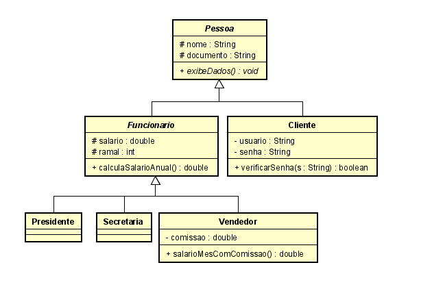

## 🚀 Atividade

Para esta Atividade Mapa, considere que sua empresa resolveu refazer o sistema de gerenciamento interno e, você foi designado para desenvolver o sistema em Java, usando conceitos de orientação a objetos. A especificação do sistema ainda não está completa, mas, seu chefe quer ver o que já foi desenhado, implementado e, em funcionamento.

Portanto, você deve implementar um sistema na linguagem de programação Java que siga as especificações do diagrama de classes abaixo.

Para a construção do sistema, você deverá utilizar a IDE de desenvolvimento NetBeans - a mesma que foi utilizado na disciplina.
 
1 - Pontos de destaque a serem implementados:
 1.1 - Lembre-se de que métodos e classes com o nome em itálico são abstratos e, que no diagrama de classes não constam os métodos acessores.
1.2 - O método "exibeDados" deve listar o nome e, o documento da pessoa, assim como qual é o papel da pessoa na organização (presidente, secretária, vendedor ou cliente).
1.3 - O método "verificarSenha" recebe uma senha como parâmetro e, compara com a senha armazenada para o cliente. Não se preocupe com criptografia, a senha vai estar em texto comum e, vai ser comparada com a que for passada com parâmetro.
1.4 - O método "calculaSalarioAnual" retornará o salário somado dos 12 meses, mais o décimo terceiro. Conta simples, mesmo.
1.5 - O método "salarioMesComComissao" vai retornar o salário do vendedor, somado à comissão dele que for cadastrada. Como a comissão é aplicada ao valor de vendas e, essa parte ainda não consta no diagrama, considere que a comissão cadastrada já é o valor final da comissão em reais.
1.6 - Todas as classes (que precisarem dos construtores) devem ter apenas um construtor vazio (sem parâmetros) e, um construtor com todos os parâmetros para já adicionar os valores na criação.
 
2 - Para garantir que o sistema funciona como esperado, seu chefe pediu para realizar as seguintes ações:
2.1 - Cadastre o presidente da empresa, que é o Asdrubal Leôncio Correa.
2.2 - Cadastre as duas secretárias, a Fátima e, a Ana.
2.3 - Cadastre os vendedores João, Vanessa e, Carlos.
2.4 - Cadastre os clientes Marcos, Joana, Elisa e, Lucas.
2.5 - Defina as comissões dos vendedores
2.6 - Calcule o salário anual do Asdrubal e, da Ana.
2.7 - O usuário Lucas esqueceu a senha dele. Verifique se a senha dele é "123456", "segredo" ou "teste".
2.8 - Mande exibir os dados de todas as pessoas (uma por uma).
 
Essas ações devem ficar em sua classe principal para que, ao executar, as ações já sejam executadas.
 
Os detalhes que você não tiver sobre as pessoas você pode inventar.

---

# 📚 O que eu aprendi com o projeto!

- Criar Classes;
- Criar Objetos;
- Definir atributos da Classe;
- Criar Métodos;
- Declaração de Contrutores;
- Utilizar modificadores de acesso;
    - public, private, protected e default;
    - final, abstract e static.
- Herança e Polimorfismo;
    - extends;
    - @Override.
- Formatação de String utilizando class DecimalFormat;
- Comparação de String utilizando o método equals().

# 💻 Tecnologias

<a href='https://www.oracle.com/java/technologies/'>Java</a>
 
<a href='https://netbeans.org/'>NetBeans</a>
 

# 📝 Sobre o projeto

Este é um projeto acadêmico. Seu principal objetivo é facilitar a avaliação dos professores.

---

O aprendizado é contínuo e o próximo nível nunca será o último 🚀 by [aalvs](https://app.rocketseat.com.br/me/aalvs).